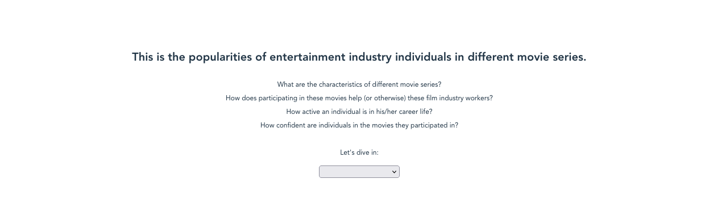
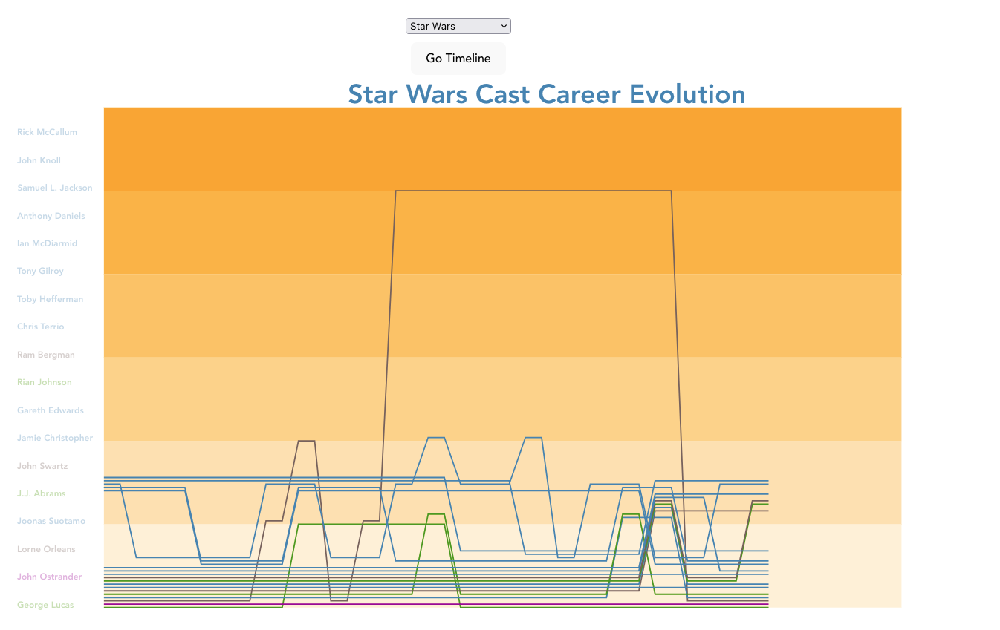
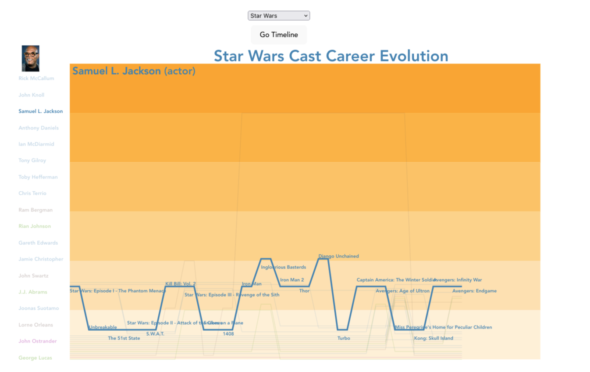
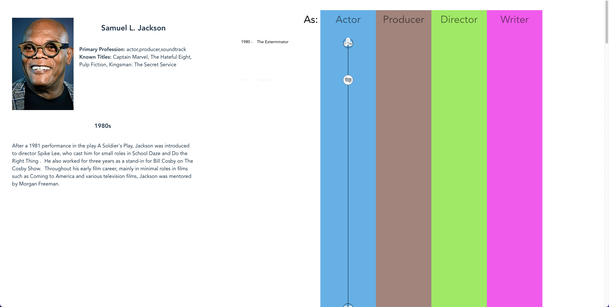
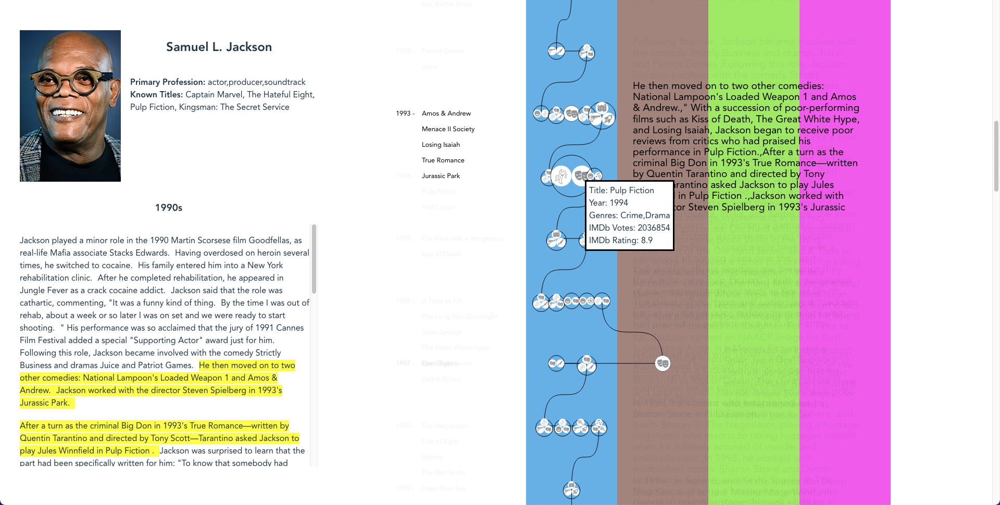

## Introduction: Data Storytelling
The system visualizes an actor/director/producer/writer's career evolution in terms of the films they've been in.
The career of each person is organized as a data-binded story. 
A `storyline` design is used for user to choose a person and 
a `timeline` design to visualize the story, with each film being a node on the timeline. 
In addition to common timeline charts, we annotate each node with text snippets scraped from the person's wikipedia page as descriptions of the film's impact on the person's career.

## Data set
### Kaggle IMDb Data Set
The first data set is an  [IMDb movie dataset](https://www.kaggle.com/datasets/ashirwadsangwan/imdb-dataset)
publicly available on Kaggle. 
The dataset contains 9,425,570 rows of films/tv series/tv shows/game shows, etc. 
We only use a subset of all the modern (post 1970) English films to demonstrate our visualization design.

### IMDb movie credits
The IMDb movie  dataset does not contain a full credit list for each film. 
The full credit list is important for us since we need to know exactly the role a person worked as in a movie for our visualization. 
We scraped the full credit list on IMDb for each film to complement the dataset. 
The scraped credit lists are then linked to the Kaggle IMDb movie Data Set using IMDb movie ids.  

### Actor Career Snippets
The IMDb movie data set and credits provides a lot of information about the films, but it does not provide information on the context of the film and how it impacts the person's career. 
We address this problem by collecting text snippets regarding to a person's career from his/her wikipedia page. 
The scraped dataset consists of different stages (e.g. early stage, middle stage, late stage) of a person's career and stage descriptions in plain texts. 
We further assign a stage for each movie and extract a short summary for each movie from the stage descriptions.

## Visualization: Overview
The overview starts with a page briefly introducing the system as shown in the figure.
We provide 5 popular franchises for user to pick from, namely `Harry Potter`, `Lord of the Rings`, `X-men`, `Star Wars` and `James Bond`.
For each franchise user can freely explore the actors/directors/producers/writers heavily involved in the franchise.




Once the user selects a franchise, a `storyline` visualization is shown where each line represents a person.
x-axis encodes year and y-axis encodes `popularity` of the person, calculated from the movies he/she participates in that year.
We use different line colors for actor/director/producer/writer.
The color gradient in y-axis is a double-encoding for popularity.
User can hover/click on each line or the text labels in the left column to choose a person.


Once a person is chose, other lines will become transparent to highlight the chosen one.
Annotations are added to provide hints for the reason of a 'turn'.
For example, we can observe from Samuel Jackson's example that many of his highest points occur when he is in an Quentin Tarantino movie, namely 'Kill Bill Vol. 2', 'Inglourious Basterds' and 'Django Unchained'.
The `Go Timeline` button allows user to go to the timeline view and inspect a full description of the selected person's entire career with detail.



## Visualization: Career View
The Career View (timeline view) is designed in a `scrollytelling` way.
User will scroll down the timeline to go through the person's career.
The view layout is divided into three main sections:
- The upper left is a brief introduction section about the selected person.
- The lower left section is a dynamic text section showing descriptions of different stages of his/her career.
The stage description text will change as the user scrolls down and enter into different stages.
- The right part of the view is a timeline with movies as nodes. 
The timeline is divided into four 'tracks' (actor/producer/director/writer) and the movie node will be in each track according to the main credit he gets in that movie.
The movie node size encodes popularity and the inner icons represent genres.

From the image below, we can see that Samuel Jackson starts his career debut as early as 1980.
From the stage descriptions we know that he is basically a student at this stage. 


As the user scrolls down and enter into later stages, more information are shown by the career view.
Additionally, if there's data for individual descriptions of the impact of the movie, it will be shown next to the movie node when it's highlighted to reduce overlaps. 
Since the individual movie snippets are extracted from the stage descriptions, we further highlight them in the original paragraphs in stage descriptions in yellow color.

From the image below we can find a small anecdote, saying that Samuel Jackson actually met Quentin Tarantino in 'True Romance'.
Then Quentin Tarantino invited Samuel Jackson to play Jules in Pulp Fiction the next year, which became a huge success in Samuel's career and they later have even more collaborations together. 


## Environment Setup

### Front end
Front end uses `Vue` + `vite`.
Navigate to project directory and run:
```shell
npm i 
npm run dev
```
This should launch the application at `localhost:5173` (port number may vary). 

### Back end
Back end uses `flask` in python. 
First setup the environment by running:
```shell
# envronment.yml is under src/server/
conda env create -f environment.yml
conda activate career_evolution
```
Then unzip `data.zip` under `src/server/`. The server will read from `src/server/data`.
To launch the server, navigate to `src/server/` and run:
```shell
flask run
# flask will automatically detect app.py as the entry, 
# so be cautious about renaming app.py
```
The default server address is `localhost:5000`. 


